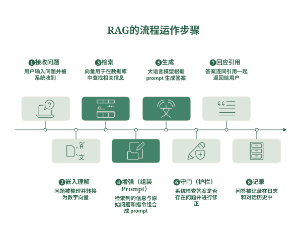
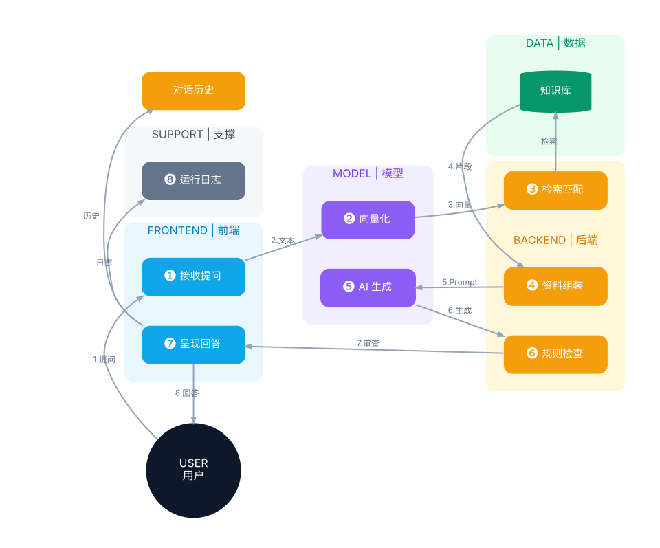
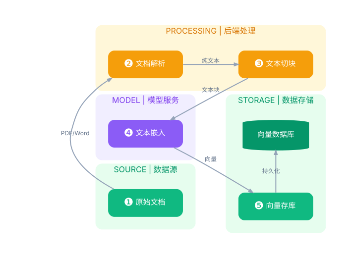
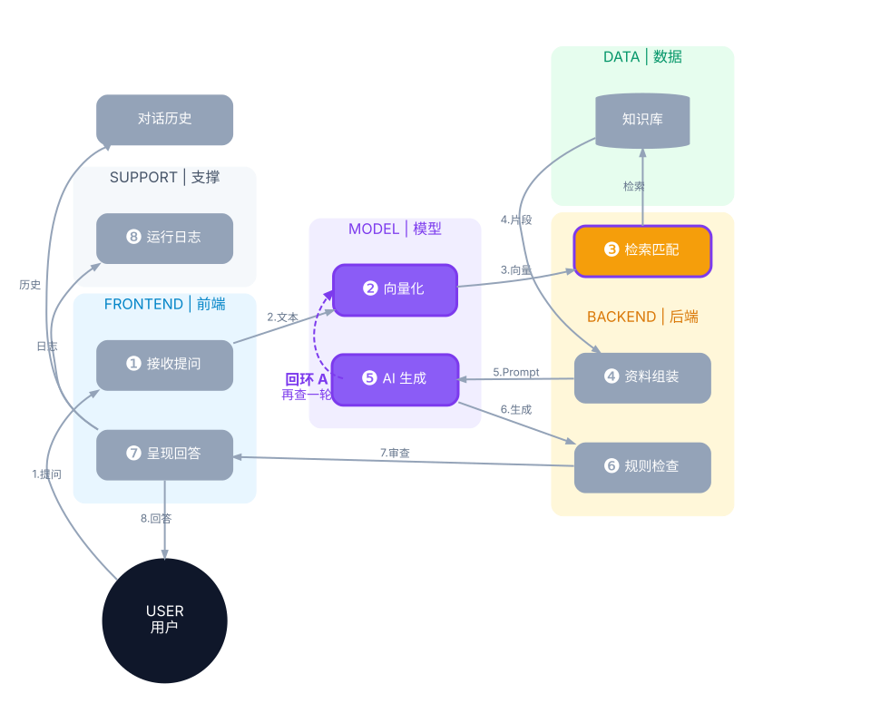
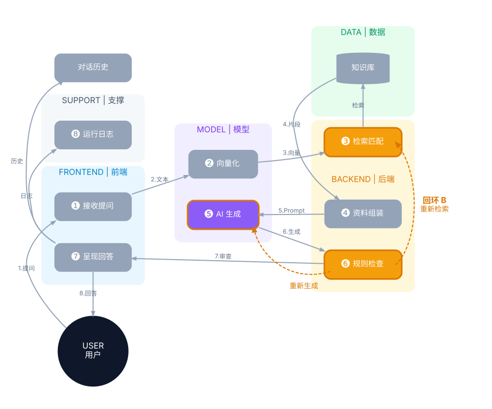
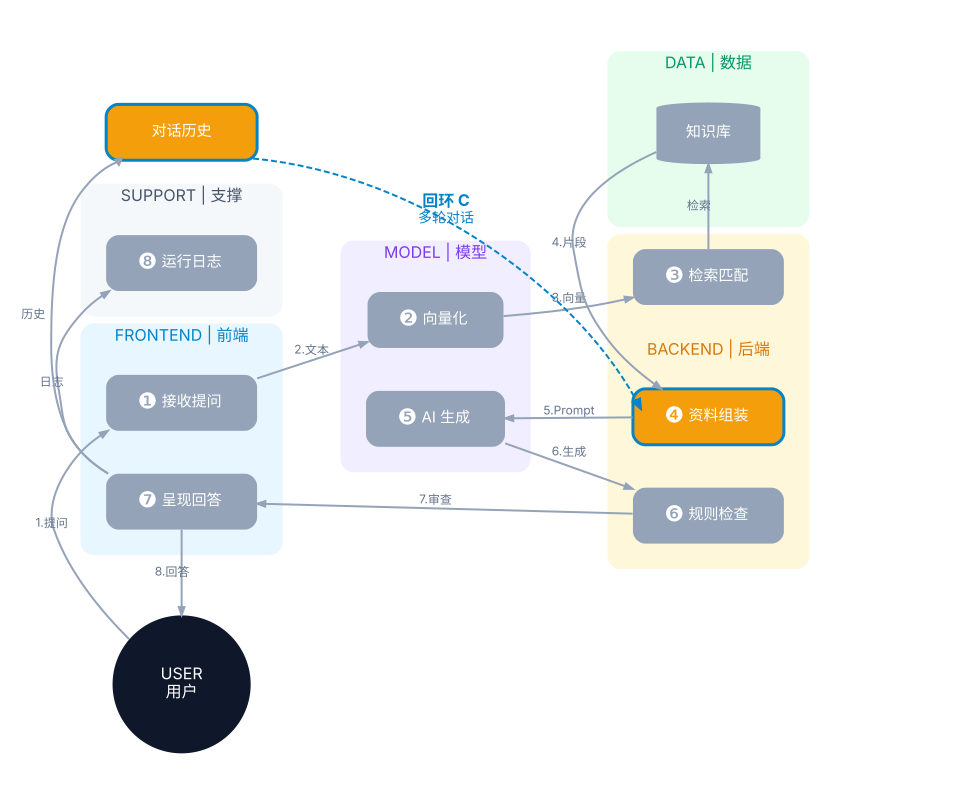
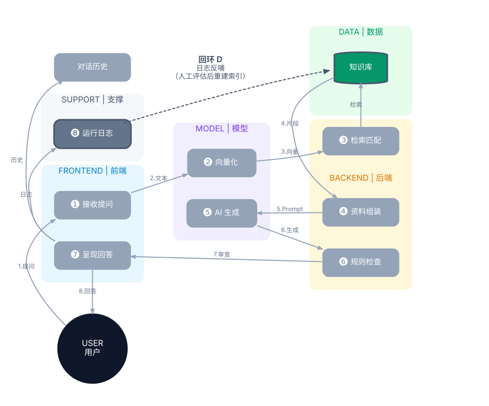

# 理解现代大语言模型系统-从RAG到全景

>
> 

---

## 开始之前：这整套系统到底在解决什么问题？

想象你是某软件产品的客户，在官网上问他们的 AI 客服："我们还在用 2023 年的旧版本，现在升级到新版，历史数据和自定义设置能不能保留？"

这种问题的答案，散落在这家公司的版本说明、迁移指南和客服手册里，而通用大模型并没有学过这些资料。所以现实中的做法是：**平时把这些文档整理好存起来，用户提问时，先从中"查"出最相关的几段，再把这几段连同问题一起交给模型，让模型"照着资料"组织出回答**。

这套"先查资料、再让模型基于资料回答"的做法，行业里叫 **RAG（Retrieval-Augmented Generation，检索增强生成）**。它是目前最主流、也最适合入门理解的 LLM 应用方式，我们就以它为主线展开。

这本书从 RAG 的流程入手，由表及里，再向外扩展到 Agent、合规、安全，以及 RAG 在整个 LLM 应用版图中的位置。

如果你是工作中绕不开 LLM、却不必亲手写代码的人——产品经理、项目经理、售前与解决方案工程师、创业者，或需要对接 AI 项目的管理者——需要的往往不是能跑的代码，而是能跟工程团队对话、评估方案、把事情跟客户讲清楚的那层理解，那么这本书正是为此而写：读完之后，应能看懂一套真实 LLM 系统的运转方式、跟上相关的技术讨论，并在面对具体需求时判断该选用 RAG 还是其他方案。

如果你是刚入门的技术人员，它则能帮你先搭起一张完整的概念地图，之后再看框架文档或动手写代码时，不至于只见树木、不见森林。

全文不需要任何数学或编程基础。内容由浅入深：前面几章从日常例子讲起，越往后越贴近系统内部的运作细节，读者可以一路读下去，也可以只取自己需要的部分。

---

## 第一章 · RAG 核心流程：一个问题怎么变成带引用的答案

八个步骤，你可以把整个过程想成"秘书处帮领导准备一份答复材料"：

| 步骤 | 系统在做什么 | 生活化类比 |
|---|---|---|
| ❶ 接收问题 | 用户输入的问题被系统收到 | 领导交办："帮我弄清楚XX这件事，给我一份答复" |
| ❷ 嵌入理解 | 先把问题"整理"得更好查——改写含糊的措辞、补上同义说法、把一个复杂问题拆成几个小问题——然后再转换成一串数字（向量），方便计算机"理解语义"并拿去跟数据库比对 | 秘书先把交办的问题理明白——含糊的地方问清楚、换成档案系统里的规范说法，才好去调文件 |
| ❸ 检索 | 拿这串数字去数据库里找最相关的几段文字。真实系统里这一步是个"先宽后窄的漏斗"：先用两条路一起找（按意思找的向量搜索 + 按字面找的关键词搜索），再按条件筛掉不该出现的（比如你没权限看的、太旧的），最后用一个更仔细的模型把剩下的候选重新排一遍序（叫"重排"），只留下最切题的几段 | 秘书去档案室调卷：几个渠道同时找，剔掉自己无权调阅的密级文件和已作废的旧版本，再逐份细读，只留下真正答得上问题的那几页 |
| ❹ 增强（组装 Prompt） | 把"找到的资料"+"你的原始问题"+"系统的行为指令"拼成一段完整的文字，准备交给模型。"增强"这个名字来自 RAG 的全称 Retrieval-**Augmented** Generation（检索**增强**生成）——用查到的资料去增强你的原始问题，指的就是这一步 | 秘书把调出的资料页、领导的原始问题、还有"照材料写、别自由发挥"的要求，一起装进一个工作夹 |
| ❺ 生成 | 大语言模型读这个文件夹，逐字写出答案 | 处里的笔杆子接过工作夹，照着里面的材料起草答复稿 |
| ❻ 守门（护栏） | 系统检查这段回答有没有问题（比如泄露不该说的内容、格式不对、明显瞎编）——这道检查机制在业界的标准叫法是"护栏"（Guardrails）。更讲究的系统还会让模型自己"对照查到的资料，把答案再核一遍"，发现出入就改（这个自查动作叫 reflection，反思修正） | 起草人先自己对照原始文件把稿子核一遍，处长再把关审定，才准上报 |
| ❼ 回应引用 | 把答案连同"这句话是根据哪份文档、哪一段"的引用一起返回给你 | 呈报领导的答复上注明"依据某文件第某条"，领导随时可以调原件核对 |
| ❽ 记录 | 系统把这轮问答记下来——通常存两份：**日志**（持久档案，给之后排查问题、审计、统计用）和**对话历史**（留给你下一个问题当背景的上下文，两份记录用途不同、存放位置也常不同） | 办公室登记备案：谁交办的、什么时候办的、调了哪些文件、答复了什么；同时把这次问答归入这位领导的往来卷宗，下次交办时随手可翻 |

<figure>

<figcaption>图 1：RAG 的八步流程运作示意图</figcaption>
</figure>

**一个提醒：通常说的"RAG"，只是这张表的中段。** 论文和教程里定义的 RAG，核心就是 ❸ 检索 → ❹ 增强 → ❺ 生成这三步——恰好对应 RAG 全称的三个词（Retrieval 检索、Augmented 增强、Generation 生成）；❷ 转向量是检索的前置动作，一般也算进去。其余几步不属于 RAG 本身：❶ 和 ❼ 是任何在线服务都有的"一收一发"，❽ 是运维记账，❻ 是生产系统的加固措施。所以当别人说"我们上了 RAG"，指的往往只是中间那一段；这张表描述的，是把 RAG 放进真实生产系统后跑起来的完整流程。

**这八步分别由哪些"部门"承担**：

| 部门 | 负责的步骤 | 是什么 |
|---|---|---|
| 前端 | ❶ 收下你的问题、❼ 把答复呈现给你 | 你打字提问、看到答案的那个聊天窗口 |
| 编排／后端 | 指挥全部八步的先后与放行；亲自动手做 ❹ 组装和 ❻ 的规则检查 | 一个看不见的协调程序——自己不"回答问题"，但决定去哪拿资料、怎么组装、生成完要不要卡下来审查。第三章会展开一条重要规则：全系统只有它是"主动发起方" |
| 模型 | ❷ 把文字转成向量（嵌入服务）、❺ 生成答案（LLM服务） | 真正做"理解语义"和"写答案"的AI。两种服务各有两种部署形态：**云端调用**（即 MaaS，Model-as-a-Service 模型即服务——模型跑在供应商云上，通过网络调用，不用自己买机器）或**自托管**（自己架机器跑，数据不出公司边界）。选哪种形态是第五章合规讨论的关键决策 |
| 数据 | ❸ 检索去查的地方 | **向量数据库**（存资料转成的向量，通常也存着原文明文备份，查到向量就能调出原文）+ **文档／对象存储**（最原始的PDF、Word文件本身存放的地方） |
| 支撑 | ❽ 记录中"日志"那一份的去处（另一份"对话历史"由后端保管，留给下一轮用） | 日志／可观测性系统——每次"谁问了什么、查了什么、答了什么"都留一份持久副本，供排查与审计。第五章会讲到：这是合规上最容易被忽略的角落 |

<figure>

<figcaption>图 2：八步分别由哪些部门承担</figcaption>
</figure>

### 离线索引：八步之外的日常准备——检索去查的资料是哪来的？

上面八步讲的都是"领导交办之后"发生的事，但有个前提被跳过了：❸ 检索去查的那个向量数据库，里面的向量是谁、什么时候放进去的？答案是一条独立于八步之外、平时就在运转的准备流水线，叫**离线索引**（"离线"的意思是：不发生在回答问题的现场，而是提前做好）：

文档 → 解析（把PDF、Word等格式读成纯文字）→ 切块（把长文档切成一段一段，比如每段几百字，因为模型一次读不了太长也不好精准定位）→ 嵌入（把每一小段转成数字向量）→ 存进向量数据库。

<figure>

<figcaption>图 3：离线索引流程——从原始文档到向量数据库</figcaption>
</figure>

这一步就像档案室**平时**就把所有文件立卷、编目、按主题归档，之后要用才能随调随到——如果不先做这一步，每次领导交办都要现场把全公司文件重新翻一遍，会慢到无法忍受。它也不是"做一次就完"：文档有新增和修订、检索策略要调整，都会触发索引更新或重建——下面的回环 D 会讲到是什么在驱动这件事。

### 这八步是一条直线吗？四个回环

单看一次顺利的问答，八步确实是从头走到尾的一条直线（前一步的产出是后一步的原料，顺序不能乱）。但真实系统会在这条主干上挂几条"回头路"，遇到特定情况就往回走：

- **回环 A · 再查一轮**：模型在生成答案前发现"查到的资料不够回答这个问题"，于是换个问法回到❷❸再检索一轮，可能反复几次，直到资料够用。**关键在于：查几轮不是程序预先写死的，而是模型自己临场判断的**——这正是后面第四章要讲的"代理式"工作方式。
- **回环 B · 守门驳回**：❻检查不通过时，系统按预先定好的规则退回❺重新生成一次，或退回❸重新检索。和回环 A 不同，这里"什么情况退、退到哪、最多退几次"都是工程师事先写死的规则，模型没有决定权。
- **回环 C · 多轮对话**：模型本身是没有记忆的——一轮问答结束，它什么都不会"记住"。你之所以能接着追问"那第二种呢"，是因为 ❽ 每轮都会把问题和答复存进**对话历史**（注意是 ❽ 存的两份记录里的这一份，不是日志）；你发新问题时，❹ 组装的工作夹里除了新问题和新查到的资料，还会把这份历史一并附上，模型当场重读一遍，才知道"第二种"指的是什么。一句话概括这个环：**上一轮的输出，会变成下一轮输入的一部分**。
- **回环 D · 日志反哺**：❽积累的日志会定期交给评估体系分析（哪类问题答得差、是检索找错了还是生成写错了），工程师根据结论调整切块方式、检索策略，再重建离线索引。这个环以天或周为周期转动，环上做决定的是人，不是系统。

<figure>

<figcaption>图 4：回环 A · 再查一轮</figcaption>
</figure>

<figure>

<figcaption>图 5：回环 B · 守门驳回</figcaption>
</figure>

<figure>

<figcaption>图 6：回环 C · 多轮对话</figcaption>
</figure>

<figure>

<figcaption>图 7：回环 D · 日志反哺</figcaption>
</figure>

### 延伸说明：RAG 的"代际"划分

RAG 自诞生以来一直在演进，行业习惯把它分成三代。

第一代叫**朴素 RAG**（Naive RAG）：八步一条直线走到底，每一步都只做最简单的版本。第二代叫**高级 RAG**（Advanced RAG）[^rag-survey]：骨架不变，但每一步做得更精细——❷ 加入改写和拆解，❸ 变成先宽后窄的漏斗，❻ 补上反思修正，再配上回环 B 这类按规则触发的重试。本章描述的"真实系统"就属于这一代。第三代叫**代理式 RAG**（Agentic RAG）[^agentic-rag]，第四章会专门展开。

三代之间的分界线，不在于有没有回环，而在于**循环由谁决定**。前两代的循环规则由工程师预先写在代码里，系统只是照章执行；代理式 RAG 则把"要不要再查、怎么查"交给模型在运行中自行判断，回环 A 就属于这种情形。至于回环 B、C、D，在前两代系统里，它们的决定权同样握在规则和人手里：B 由预设规则触发（规则内部可以请模型充当"打分员"，比如让模型给检索结果的质量打分，但打分之后走哪条路仍由规则决定），C 按固定方式附带历史，D 由工程师驱动，所以它们的存在不改变代际判断。反过来，一旦把某个环的决定权真的交到模型手里——比如让模型自行判断答案是否有依据、要不要重查重写（业界确有这类做法，如 Self-RAG[^selfrag]）——按同一标准，这个环也就代理化了。归结起来：三代用的组件是一样的，变的是指挥权在谁手里。

[^rag-survey]: Gao et al., *Retrieval-Augmented Generation for Large Language Models: A Survey*, 2023——"朴素 RAG／高级 RAG／模块化 RAG"三代划分的最早出处。原文第三代叫"模块化 RAG"（Modular RAG），本节换成了更贴切、也更常用的"代理式 RAG"提法，出处见下一条脚注。https://arxiv.org/abs/2312.10997

[^agentic-rag]: Singh et al., *Agentic Retrieval-Augmented Generation: A Survey on Agentic RAG*, 2025。https://arxiv.org/abs/2501.09136

[^selfrag]: Asai et al., *Self-RAG: Learning to Retrieve, Generate, and Critique through Self-Reflection*, ICLR 2024（oral，入选前 1%）。https://arxiv.org/abs/2310.11511

---

## 第二章 · 模型适配：通用模型怎么变成能用的系统

AI 客服上线之后，团队收到了三类不同的抱怨。

**第一类：答不上来。** 客户问上周刚发布的新版本有什么变化，客服说不知道——那份发布说明还没进知识库。

**第二类：答得对，但没法看。** 内容其实准确，可一大段话糊在一起，不分点、不标依据哪份文档，语气还时不时飘忽。团队希望它每次都先给结论、再列步骤、末尾附上文档链接。

**第三类：答得文从字顺，但驴唇不对马嘴。** 一位半导体客户用一连串行业术语提问，客服回得头头是道，内容却完全不着边际——它压根不理解这些词在这一行里指什么。

三类抱怨听上去都是"AI 不好用"，病因却完全不同：第一类是**不知道**，第二类是**不会说**，第三类是**听不懂**。任何一个通用模型拿来做具体业务，都会在这三处露出落差；把通用基座模型改造成某个场景真正可用的系统，这件事叫**模型适配**。

### 干预点只有两个：输入，或者权重

三类落差有三种解法。区分它们最简单的办法，是看这个解法到底动了什么：是不碰模型、只改每次递到它面前的材料，还是直接去改模型本身。

一种是干预**输入**：模型本身一个参数都不动，只在每次提问时把该看的资料塞进去。第一章的 RAG 就是这一类。

另一种是干预**权重**：直接改动模型内部的参数。所谓参数（也叫权重），就是模型内部的一大堆数字，动辄几十亿上千亿个——模型的全部本事都存在这堆数字里：认识哪些词、习惯怎么措辞、看到上文之后判断下一个字该写什么。所谓"训练"，做的就是一轮轮微调这些数字。这类改动一旦完成就固化在模型里，之后每次回答都带着它。**微调**和**继续预训练**属于这一类。

### 三种手段各自归位

| 手段 | 治哪一类落差 | 干预点 | 更新与代价 |
|---|---|---|---|
| **RAG（检索增强生成）** | **不知道**：资料模型没见过——公司文档、最新变动 | 输入 | 换一份文档立刻生效；代价在每次提问的检索与长提示词 |
| **微调 SFT**（Supervised Fine-Tuning，监督式微调） | **不会说**：格式、语气、行为不合要求——比如要求固定的结论加步骤结构、统一的引用格式 | 权重 | 需要准备一批"问题＋标准答案"样例并训练；要改就得重训 |
| **继续预训练** | **听不懂**：领域语言本身超出模型的理解范围——重代码、专业法律语料、小语种专业文本 | 权重 | 需要海量领域文本和大量算力，通常只有大机构才做 |

> **注：什么叫"重训"？** 指的是把训练流程重新跑一遍——准备好一批新的样例数据，让模型在这批数据上再学一轮，产出一个新版本的权重（或新版本的 adapter）。它不像改一行配置那样随时可做，但也没有很多人想象的那么遥不可及。
>
> **在微调这件事上，算力这一关早就不是门槛了。** 得益于 LoRA 这类只训练一小部分参数的技术，2026 年做一次 7–8B 规模模型的微调，租用 GPU 的花费大约在几美元到十几美元之间，耗时两到四小时；用托管服务按量计费，一次典型任务也就几十美元的量级。[^lora-cost][^lora-cost-more]
>
> **真正费力的是训练之前和之后。** 业界的共识是：GPU 已经不是主要开销，数据准备和效果评估才是——把一个微调项目从头做完（整理样例、清洗标注、反复试验、建立评估集），整体投入通常落在数千到上万美元的区间，其中大部分花在人和数据上，而不是算力上。所以"要改就得重训"的负担，主要不在于跑一次训练有多贵，而在于每次改动都要重走一遍准备与验证的流程。
>
> **继续预训练则完全是另一个量级**：它消耗的是海量领域语料和大规模算力，通常需要专门的团队和基础设施。

> **微调不只一种做法。** 上表里的 SFT，是给模型一批"问题＋标准答案"让它照着学。另一种做法叫**强化微调**（RFT，Reinforcement Fine-Tuning）：不给标准答案，只给一个"打分器"——一段能判断答案好坏的程序或规则。训练时，模型对同一个问题多次尝试作答，打分器逐个打分，得分高的作答方式就被强化下来。[^rft] 它适合"答案对不对可以客观判定、却很难写出唯一标准答案"的任务。这条路线也是推理模型背后的关键方法之一：DeepSeek-R1 的研究表明，只用这种按结果打分的强化学习、不提供人工写好的推理过程，模型也能自己练出反思、验证这类推理习惯。[^deepseek-r1] 

**用错工具是常见的坑，其中最典型的一种是：想让模型掌握新知识，于是去做微调。** 研究已经反复验证，模型很难通过微调学到新的事实——引入新知识的训练样例，学得明显比其他样例慢；而等这些新知识终于被学会，模型编造内容的倾向反而会随之上升。[^gekhman]结论是：事实知识主要在预训练阶段获得，微调教会模型的是更高效地调用它已有的知识。所以，遇到模型答不上来的情况（本章开头的第一类抱怨），正确的解法是把资料查出来摆到它面前，而不是把资料固化进权重里。

反过来也一样：RAG 不会改变模型的行为、语气和输出格式。模型啰嗦，RAG 治不了；格式不对，RAG 也修不好。第二类抱怨只能靠微调解决。

### 现实中它们通常叠加使用

这三种手段不是三选一。生产系统里常见的组合是：用一个 adapter（一种轻量级的微调附加模块，不改动整个模型，只在旁边挂一小块新参数，代表做法是 LoRA）负责语气和引用格式，同时用 RAG 管住知识——adapter 每季度更新一次，知识库持续更新。原则可以概括成一句：**语言靠训练，事实靠检索；会变的东西不要固化进权重里。**

动手顺序也有讲究。成本最低的手段是调整提示词，其次才是 RAG，再往后才轮到微调。业界的通行建议是：在决定微调之前，先确认已经有一套评估集，并且"提示词 + RAG"的方案确实没能通过它——否则很可能花了训练的钱，却没解决真正的问题。

无论走哪条路，终点是同一个地方：模型的权重（基座模型，加上可能叠加的 adapter）→ 推理服务（模型实际"跑起来"生成答案的过程）→ 答案。下一章要讲的，就是这套东西具体是怎么运转的。

[^lora-cost]: Stratagem Systems, *LoRA Fine-Tuning Cost in 2026: Real GPU Prices, QLoRA Math & Free Calculator*，2026 年 7 月核价。https://www.stratagem-systems.com/blog/lora-fine-tuning-cost-analysis-2026

[^lora-cost-more]: 具体价格随硬件与服务商变动，此处仅示意量级；同一量级的数字在 [io.net《LLM Fine-Tuning Budget Guide: GPU Costs, Timelines, and What to Spend》](https://io.net/blog/llm-fine-tuning-budget-guide-gpu-costs-timelines-and-what-to-spend)、[Awesome Agents 微调成本对比](https://awesomeagents.ai/pricing/fine-tuning-costs-comparison/) 里也能找到旁证，但本节引用的具体数字均出自上文标注的 Stratagem 那篇。

[^gekhman]: Gekhman et al., *Does Fine-Tuning LLMs on New Knowledge Encourage Hallucinations?*, EMNLP 2024。https://arxiv.org/abs/2405.05904

[^rft]: OpenAI, *Reinforcement fine-tuning*（官方文档）。https://developers.openai.com/api/docs/guides/reinforcement-fine-tuning

[^deepseek-r1]: DeepSeek-AI, *DeepSeek-R1 incentivizes reasoning in LLMs through reinforcement learning*, Nature 645, 633–638 (2025)。https://arxiv.org/abs/2501.12948

---

## 第三章 · 深入专题：四个最核心的技术机制

### 3.1 Embedding（嵌入）：机器怎么"理解"语言的意思

**先讲为什么需要它**：计算机本质上只会算数字，不懂"猫"和"狗"这两个字有什么关系。但如果我们能把每个词、每句话都变成一串数字（比如1024个数字组成的一个"坐标"），并且让"意思相近的词句"在这串数字所代表的空间里"离得近"、"意思不相关的词句"离得远，那么计算机就能通过**算两个坐标之间的距离**，间接判断出"这两句话讲的是不是同一件事"。这串数字就叫做"嵌入向量"（embedding vector），这个转换过程就叫"嵌入"。

**一个比喻**：想象一个超大的图书馆，馆员不是按书名字母排序，而是把**主题相近的书摆在相邻的书架上**——讲猫的书和讲狗的书因为都属于"宠物"大类，会摆得比较近；讲猫的书和讲汽车维修的书，会摆得很远。你想找"跟这本书类似的书"，只需要看它旁边摆了什么。嵌入做的就是这件事，只不过它不是把书摆在三维的书架上，而是摆在一个有几百上千个维度的抽象空间里（人脑没法直接想象"1024维空间"长什么样子，但数学上完全可以计算）。

**这串数字是怎么"学"出来的**：不是有人手动规定"猫＝[0.2, 0.8, ...]"，而是通过一种叫"对比学习"（contrastive learning）的训练方法——给模型看大量"这两句话意思相关"和"这两句话意思无关"的例子，每次模型判断错了就微调一下，让"相关的"在空间里拉得更近、"无关的"推得更远。这样重复几百万次之后，模型就自己"摸索"出一套坐标系统，使得"离得近＝意思相近"这个规律成立。**没有任何一个维度是人特意设计成"代表某个具体含义"的**——意思是分散在全部维度共同组成的"位置"里的，就像一个人的性格不是由单独一项特质决定，而是由很多特质共同构成的整体印象。

**具体技术流程（分两步）**：

1. **分词（Tokenizer）**：先把文字切成模型能处理的小单位，叫"token"。要注意 token 不是"词"也不是"字"，而是**按出现频率划分的片段**：常用算法（BPE、SentencePiece）先把文字拆到最小单位，再反复把"最常一起出现的一对"合并，直到凑够一个词表（如今主流模型多在 10 万到 26 万个片段之间：Llama 3 约 12.8 万、Qwen3 约 15.2 万、GPT-4o 约 20 万、Gemma 3 约 26.2 万[^vocab]）。所以高频词可能整个是一个 token，生僻词则被拆成几个子词片段。

   这样设计有个好处：再罕见、再新造的词，也总能拆成已知的子词甚至单个字节来表示，不会出现"这个词不认识、无法处理"的情况——这是早期分词方法的一个常见失败点。

   还有一点对成本很实际：**同样一段话，不同语言、不同模型占用的 token 数可能差别很大**。模型的收费和"一次能处理多长"都按 token 数算而非字数，而早期的分词器对中文并不友好，同样的意思往往要多花不少 token。新一代分词器已经大幅改善：OpenAI 发布 GPT-4o 时公布，同一段示例文字，中文所需的 token 从 34 个降到 24 个，和英文持平。[^gpt4o-tok] 所以具体差多少，要看用的是哪个模型的分词器。
2. **编码（Transformer 神经网络）**：把切好的token序列，喂进一个叫"transformer"的神经网络，它会给每个token算出一个向量，然后通过"池化"（把很多token的向量合并压缩成一个代表整句话的向量）和"归一化"（把向量的长度统一调整为1，方便后面用固定方法比较相似度），最终得到一个能代表整句话意思的向量。这个向量有多少个数字（即"维度"），2026年常见的范围是384到4096，通用场景一般从768或1024起步，再根据检索效果和存储成本调整。

> **补充**：嵌入模型的实现路线不止一种，而且一直在演进。最早的传统路线是先学词向量，再通过平均或加权汇总得到句向量，代表是 2013 年的 **word2vec** 和 2014 年的 **GloVe**；2016 年的 **FastText** 在此基础上加入了子词信息；2019 年前后，**Sentence-BERT** 这类专门为句子相似度训练的 **Siamese（孪生）网络**流行起来，骨干换成了 BERT 一类编码器。2023 年底以来，又出现了一批以大语言模型为底座、在其上加装池化层并做对比微调的嵌入模型（如 E5-mistral、GritLM、NV-Embed），先后在 MTEB 公开榜单上取得领先成绩。[^embed-routes] 不过对使用者而言，结论是一样的：不管底层用哪种方法训练出来，拿到手的都是一个可以直接拿去算距离的句子向量，不需要关心它是怎么来的。

**一个必须知道的限制：嵌入模型一次能读的文字有上限。** 每个嵌入模型都规定了单次输入的最长token数，超过的部分会被直接截掉，而且不会有任何报错提示——一段被切得过大的文本，后半截可能根本没有进入向量，检索时自然永远找不到。这正是第一章"离线索引"要先把长文档切块的硬性原因之一：切块的大小必须落在所用嵌入模型的长度上限之内。

**一个容易踩坑但很重要的规则**：你事先把资料库里的文档转成向量存起来（这叫"索引"），跟用户提问时把问题转成向量（这叫"查询"），**必须用同一个嵌入模型来做**。原因很简单：不同模型"学出来的坐标系统"是不一样的，就像两份地图如果用了不同的比例尺和不同的坐标原点，你没法直接拿A地图上的坐标去B地图上找对应位置。所以如果要换一个嵌入模型，不能只换查询那一端，**必须把整个数据库的向量重新算一遍（叫 re-embed）**，而且库里的向量和查询向量维度必须一致。

上面说"维度必须一致"，指的是存进库里的那些向量和提问时算出来的向量，长度必须一样——不然根本没法拿来比较。但这不等于维度本身是固定死的。现在的主流模型普遍支持一种叫 **Matryoshka（套娃）** 的技术：同一个模型算出的长向量，可以直接砍掉后面一截来用，不必重新训练——比如把1024维只保留前256维，检索效果通常只下降百分之几，存储和检索成本却大幅降低。想这样省成本完全可以，只要存进库里的和提问时算出的都砍到同样的长度就行。

### 3.2 Retrieval（检索）：怎么把该找的都找出来

第一章说过，真实系统里的检索是一个"先宽后窄的漏斗"。这一节讲清楚这个漏斗为什么要这样设计——每一层各自弥补上一层的什么缺陷。

**先说底层能力：向量检索能做什么**

3.1 讲过，意思相近的文字，向量会离得近。所以"检索"最基础的做法就是：把问题也转成向量，去库里找位置最接近的若干条。至于"接近"具体怎么算，工程上通常得到一个 0 到 1 之间的分数，越接近 1 表示意思越贴近——你在系统里看到的 "score 0.82" 就是这个分数。原理上它算的是两个向量的夹角，方向越一致分数越高。

这个做法最大的好处是**不依赖字面上的完全一致**。用户问"怎么把老数据搬到新版本"，文档里写的是"历史记录迁移方案"，两句话没有一个词相同，向量检索照样能对上。这正是它相对传统关键词搜索的根本优势。

**第一层缺陷：数据量一大，逐条比对就慢得无法接受**

如果库里有一千万条向量，每次提问都要跟全部比一遍再排序，实时问答根本扛不住。解决办法是 **ANN（近似最近邻）**：不追求百分之百找到最相似的那几条，而是靠预先建好的索引结构，只比对其中一小部分，用极小的精度损失换来几百倍的速度。

这个"精度"有个标准的衡量方式，叫 **recall@k（前 k 条召回率）**：真正最相似的前 k 条里，实际被找回来了几条。它是一个可以调节的旋钮，而不是固定档位——而且越往高处代价越陡：召回率越往接近 100% 推，需要多比对的候选就越多，延迟增长得比召回率本身快得多。所以多数生产系统不会去追求接近满分的召回率，而是在"找得准"和"跑得快"之间找一个够用就好的平衡点。

具体的索引结构主要有三种，选哪个取决于数据规模：

- **HNSW**（分层可导航小世界图）：把所有向量预先连成一张"邻居关系图"，查询时像玩"六度分隔"游戏，从一个起点出发，每次跳到离目标更近的邻居，几步就能逼近目标区域。2026 年多数生产系统的默认选择，召回率高、支持随时新增数据。它唯一的硬限制是整张图必须放进内存，数据量一旦大到单机内存装不下，就得换别的方案。
- **IVF**（倒排文件索引）：先用 k-means 把所有向量粗略分成若干个群，查询时只在最相关的几个群里细找。内存占用比 HNSW 小，但同等条件下召回率也更低，适合数据量大、内容基本不变、内存吃紧的场景。
- **DiskANN**：把完整索引放在固态硬盘上，内存里只留压缩后的向量和导航结构。十亿级数据量下的标准答案——论文里，在一台只有 64GB 内存的工作站上，对十亿条向量做到了 95% 以上的召回、平均延迟不到 3 毫秒；同样一台机器能承载的数据量，是 HNSW 这类纯内存图索引的 5 到 10 倍。[^diskann]

这些方法的实现可见于 FAISS（一个开源的向量检索函数库）以及各类商用向量数据库。

**第二层缺陷：向量检索会漏掉"必须一字不差"的东西**

向量的长处是理解语义，短处也正在于此——它对**字面**不敏感。用户问"X-200 型号支持不支持这个功能"，向量检索很可能找回一堆讲产品规格的段落，却漏掉真正写着 X-200 那一行。产品型号、错误代码、人名、法条编号、版本号这类内容，差一个字符就是另一回事，语义相似度对它们几乎无能为力。

所以生产系统通常**同时跑两路检索**：向量检索负责"意思对得上"，关键词检索（业界常用的算法叫 BM25）负责"字面对得上"，再把两边的结果合并。这就是**混合检索（hybrid search）**，也是第一章说的"两条路一起找"。合并时因为两套分数不在同一个尺度上，需要一个换算规则，常见做法叫 RRF（倒数排名融合）——不比较分数本身，只看每条结果在各自榜单里排第几，排名靠前的综合得分就高。

**第三层缺陷：找回来的东西，用户未必都有权限看**

检索结果直接进 prompt 是危险的：不同用户能看的文档不同，客户不该看到内部版本的文档，外部合作伙伴不该看到内部定价明细。所以在切块入库时，每一块都要带上它来自哪份文档、那份文档谁能看（即 ACL 权限信息），检索时按提问者的身份实时过滤。同理还有时效性过滤——已作废的旧版本文档不该被翻出来当依据。

这一步在工程上比听起来棘手：**先过滤再搜索**会破坏 ANN 索引的结构（那张邻居关系图是按全量数据建的，抽掉一部分点，路就断了）；**先搜索再过滤**则可能出现搜回来 50 条、过滤完只剩 2 条甚至一条不剩的情况。成熟的向量数据库为此提供了专门的过滤检索机制，但这仍是实际部署中最容易出性能问题的环节之一。

这个顺序还有一层安全含义。OWASP 2026 版专门指出：如果相似度搜索先在全量数据上跑、权限过滤放到检索之后，攻击者即使一份别人的文档都看不到，也能从返回结果的数量、分数的分布、响应的快慢，推测出别人文档的存在和大致主题——在多个客户共用一个向量库的产品里，这就是跨客户泄露。所以它建议把权限范围直接写进检索查询本身，敏感场景干脆按客户分开建库。[^owasp-llm09] 性能和安全在这里指向同一个结论：权限过滤要做在检索里面，而不是检索之后。

**第四层：粗筛出来的几十条，还要再精选**

前面几层的目标是"**别漏**"——宁可多拿回一些。但塞进 prompt 的资料不能太多：既有长度限制，也因为无关内容会干扰模型判断。所以最后需要一轮**重排（rerank）**：用一个更精细但更慢的模型，把粗筛出的几十条逐条与问题比对，重新打分排序，只留最切题的几条。

重排模型和嵌入模型的工作方式不同：嵌入模型是把问题和文档**各自**转成向量再比距离，快但粗糙；重排模型是把问题和文档**放在一起**读一遍再打分，慢但准得多。正因为慢，它只能用在候选已被缩小到几十条之后——这也解释了整个漏斗为什么必须是"先宽后窄"：先用快而粗的方法把范围从百万缩到几十，再用慢而准的方法从几十里挑出几条。

### 3.3 LLM Serving（推理服务）：模型怎么同时应付很多人

前面两节讲的是"资料怎么找出来"，这一节讲资料交给模型之后的事。注意这里的关键词是**服务**（serving）——重点不只是模型内部怎么算，而是一台服务器要同时应付成百上千个用户时，是怎么组织的。

**一次推理分两步**

模型生成文字的方式叫**自回归**：一次只吐出一个 token，把它接到已有文字后面，再基于"到目前为止的全部文字"猜下一个，直到猜出表示结束的符号。

由此产生两个阶段，运算特性正好相反：

- **Prefill（预填充）**：把整段输入（系统指令 + 检索到的资料 + 用户问题）**一次性并行读完**，为其中每个 token 都算好两样东西（K 和 V，下面解释），存进一块叫 **KV cache** 的显存暂存区。这一步吃的是算力。
- **Decode（解码）**：从第一个字开始，**逐个、串行**地生成。每写一个新字，都要回头参考前面全部内容。这一步吃的是内存读取带宽——瓶颈不在算得快不快，而在能多快把 KV cache 读进来。

**KV cache 为什么必须存在**：decode 每写一个字都要回看前文，如果每次都把前面所有字重新算一遍，写到第 100 个字时就要重算前 99 个字——这种重复计算随文字变长呈平方级膨胀，长文本根本没法用。把算过的结果存下来复用，计算量就降到接近线性。**用显存换掉重复计算**，这就是 KV cache 的全部意义。

那么 K 和 V 是什么？模型处理每个字时会算出三个向量：**Q**（这个字带着的问题："前面哪些字跟我相关"）、**K**（每个字举的牌子，写着"我是讲什么的"）、**V**（这个字真正携带的信息）。当前字拿自己的 Q 去和前面每个字的 K 比对，谁匹配度高就给谁更高权重，再把各字的 V 按权重加权平均——这就是"注意力"。之所以只缓存 K 和 V 不缓存 Q，是因为 K 和 V 会被后面每一个新字反复用到，值得存；而 Q 只在当下这一步用一次，用完即弃。

**衡量快慢的两个指标**

这两个阶段各自对应一个业界通用指标，看懂它们就能读懂大部分推理性能讨论：

- **TTFT**（Time To First Token，首字延迟）：从发出请求到看到第一个字的时间，由 prefill 决定。
- **TPOT / ITL**（每个输出 token 的间隔）：开始输出后，字与字之间的节奏，由 decode 决定。

值得注意的是，**总等待时间通常由 decode 主导**。举个例子：假设一个普通（非推理）模型每秒输出 60 个 token 左右，也就是每个 token 间隔约 17 毫秒，那么一个 500 token 左右的回答，光 decode 就要花掉约 8 秒；相比之下，首字延迟可能只有零点几秒。所以"回答越长越慢"是线性累加的，感受非常直接。

**推理模型让 decode 的分量更重了。** 2024 年起出现的"推理模型"（reasoning model），在给出答案之前，会先生成一大段内部思考。这段思考也是逐个 token decode 出来的：通常不展示给用户，但同样占用上下文窗口，同样按输出 token 计费。[^reasoning] 对用户来说，体感就是首字延迟变长了——屏幕上出现第一个字之前，模型可能已经默默写了大量的思考。OpenAI 发布第一个推理模型 o1 时就指出，模型思考的时间越长，表现越好[^o1]，这等于用推理阶段的算力和等待时间去换答案质量。

**服务器怎么同时应付很多人：连续批处理**

如果服务器一次只处理一个请求，处理完再接下一个，GPU 大部分时间都在空转——因为 decode 阶段算力用不满，浪费严重。

现代推理框架（vLLM、SGLang 等）采用的做法叫**连续批处理（continuous batching）**：每一轮迭代，让当前所有活跃请求**各自前进一个 token**，然后进入下一轮；有请求结束就退出批次，有新请求进来就随时加入，不必等整批做完。这是把 GPU 喂饱的关键，也是它能同时服务几十上百个用户的原因。

早期的连续批处理还会带来一个现象：**回答写到一半突然卡顿**。新请求的 prefill 整段挤进批次时要占用大量算力，正在逐字输出的请求只能等它算完，用户看到的就是文字流突然停住。现在的主流框架已经专门处理了这个问题：vLLM 默认开启"分块预填充"（chunked prefill），把长的 prefill 切成小块，并优先安排正在输出的请求，官方说明这能改善字与字之间的间隔[^vllm-chunked]；更进一步的做法，是把 prefill 和 decode 拆到不同的机器上运行（预填充-解码分离）。

**几条实用的成本规律**

- **输入很长时，prefill 成本上升得比想象中快。** 模型里只有"注意力"这一部分的计算量随输入长度呈平方级增长，其余部分都是线性的。据 Kaplan 等人的估算，只要输入长度不超过模型宽度（模型内部的一个尺寸参数）的 12 倍，与长度相关的那部分计算就只占总量的一小部分。[^kaplan] 对大模型来说，这个门槛在数万 token 以上：输入只有几千 token 时，资料翻倍，开销也大致翻倍；输入长到门槛以上，平方项开始主导，增长才会明显快于线性。这是"塞更多资料进 prompt"要付的隐性代价。
- **答案越长，decode 时间线性增加**，且它通常主导用户的总等待时间。
- **KV cache 很占显存**，并且随着上下文变长而增长——它是决定一台机器能同时服务多少人的主要限制。为此业界发展出了 **PagedAttention**[^pagedattention] 这类优化：像操作系统管理内存分页那样管理 KV cache，避免大块显存被闲置浪费，开源推理框架 vLLM 用的就是这个方法。

**一个针对 prefill 的重要优化：提示缓存（prompt caching）。** RAG 系统的每次请求，开头往往是完全相同的——同一段系统指令，有时还有同一份长文档。既然内容一样，算出来的 KV cache 也一样，那就没必要每次重算。所以云端服务商普遍提供跨请求的前缀缓存：把这部分 KV cache 保留一段时间（从几分钟到 24 小时不等，视服务商和设置而定）[^cache]，后续请求命中相同开头时直接复用，省下的正是 prefill 那笔平方级的开销。

这个机制有一个容易被忽略的含义：KV cache 并不像通常以为的那样"算完即丢、只存在于当次请求"。开启缓存后，一部分内容会在服务商的基础设施里短暂驻留——第五章讨论合规时会再回到这一点。

### 3.4 谁跟谁说话：一次提问里系统各部件怎么分工

**核心规则**：整个系统里，**只有"后端／编排层"会主动发起动作**。向量数据库、模型服务这些部件都是被动的——有人来问才回应，而且它们**彼此之间从不直接对话**。

用第一章的秘书处来说，后端就是主办这件事的那位秘书。去哪个档案室调卷、调不到怎么办、材料够不够、要不要再补一轮、稿子能不能上报——每一个决定都是他做的，出了岔子也是他担责。档案室只负责"有人来调就给"，笔杆子只负责"接到材料就写"，两边从不直接打交道，甚至不知道对方存在。所以后端不是个传话筒，而是这件事唯一的负责人。

**完整的通信步骤**：

1. **前端 → 后端**（对应第一章 ❶ 接收问题）：用户的问题被送到后端。
2. **后端 → 嵌入服务**（对应 ❷ 嵌入理解）：把问题文字送过去，请它转换成查询向量。
3. **后端 → 向量数据库**（对应 ❸ 检索的前半段）：拿查询向量做相似度检索，同时按提问者的身份做权限过滤（ACL，Access Control List，访问控制列表），取回最相关的若干条（叫 top-k）。3.2 讲的关键词检索通常也在这一步完成——多数向量数据库自带这个能力，一次调用就能拿回两路结果并合并；只有当关键词索引是另一套独立系统（比如单独部署的 Elasticsearch）时，这里才会变成两次调用，再由后端把两边结果合并。
4. **后端 → 重排服务**（对应 ❸ 检索的后半段）：把粗筛出的几十条连同问题一起送过去，请它逐条打分排序，只留最切题的几条。重排模型和嵌入模型同属一类——都是跑在 GPU 上的独立模型服务，可以自建，也可以调用现成的 API。
5. **后端（自己内部完成，不调用任何人）**（对应 ❹ 增强）：把系统指令、检索到的原文、对话历史、用户问题拼成完整的 Prompt。
6. **后端 → 生成模型服务**（对应 ❺ 生成）：把完整 Prompt 送过去，请它生成答案。
7. **后端 → 前端**（对应 ❻ 守门与 ❼ 回应引用）：一边接收模型吐出的文字一边检查，通过的部分连同引用来源一起推送给界面。
8. **后端 → 日志系统**（对应 ❽ 记录）：把这次问答的全过程写一份记录留底。

**两套"八步"为什么对不齐**：第一章按"做了什么动作"划分，这一节按"谁给谁发消息"划分，两种分法本来就不是一一对应的。❸ 检索是一个动作，却要发出两到三次通信；❻ 守门和 ❼ 回应引用是两个动作，却共用同一次回传。同一个系统，换个角度看，切分方式自然不同。

**关于第 7 步：答案是"流"过去的，不是等写完才"传"过去的**

3.3 讲过模型是逐字生成的。后端并不会等整段答案生成完再回传，而是一边接收一边往前端推，这就是文字一个个蹦出来的原因（技术上通常用 SSE 或 WebSocket 实现）。

这带来一个真实的工程矛盾：**流式输出和守门是冲突的**。字都已经推到用户屏幕上了，怎么还能"检查完再放行"？实践中的折中办法是边推边检测，一旦发现问题立即中断，把已显示的内容撤回或替换掉。这也是为什么有时会看到 AI 的回答写到一半突然消失，变成一句"抱歉，我无法回答这个问题"。

**四个值得记住的重点**：

1. **各个下游部件彼此互不知道对方存在**。向量数据库不知道有模型服务，重排服务不知道有日志系统——是后端把前一个部件的产出，翻译成下一个部件看得懂的格式再递过去。部件越多这一点越明显：上面八步里后端要打交道的对象有六个，而它们相互之间的连线是零。

2. **一切判断和把关只能发生在后端**。只有它看得到全貌，而且它处在公司自己能控制的范围内（模型服务很可能是别家公司的）。这就是为什么合规和安全审查逻辑必须放在这一层，第五、六章会详细展开。

3. **后端还负责所有的"出岔子怎么办"**。模型服务限流了要不要排队重试、检索超时了是降级回答还是直接报错、某一步失败后回退到哪里——这些判断只有后端做得了。真实系统里，处理异常的代码往往比处理正常流程的还多，这也是"负责人"和"传话筒"的区别所在。

4. **代理式 RAG 并没有改变这张图**（第四章详细讲）。它只是让后端把第 2 到第 4 步多跑几轮，而且轮数由模型临场决定。分工结构、谁能跟谁说话，一点没变。

[^vocab]: Meta, *Introducing Meta Llama 3*, 2024：「a tokenizer with a vocabulary of 128K tokens」。https://ai.meta.com/blog/meta-llama-3/ ；Qwen Team, *Qwen3 Technical Report*, 2025：「vocabulary size of 151,669」。https://arxiv.org/abs/2505.09388 ；OpenAI tiktoken 源码中的 o200k_base 编码（GPT-4o 使用），结束符编号为 199999。https://github.com/openai/tiktoken ；Gemma Team, *Gemma 3 Technical Report*, 2025：「262k entries」。https://arxiv.org/abs/2503.19786

[^gpt4o-tok]: OpenAI, *Hello GPT-4o*, 2024-05（Language tokenization 一节）。https://openai.com/index/hello-gpt-4o/

[^embed-routes]: Mikolov et al., *Efficient Estimation of Word Representations in Vector Space*, 2013（word2vec）。https://arxiv.org/abs/1301.3781 ；Pennington et al., *GloVe: Global Vectors for Word Representation*, EMNLP 2014。https://aclanthology.org/D14-1162/ ；Bojanowski et al., *Enriching Word Vectors with Subword Information*, 2016（FastText）。https://arxiv.org/abs/1607.04606 ；Reimers & Gurevych, *Sentence-BERT: Sentence Embeddings using Siamese BERT-Networks*, EMNLP 2019。https://arxiv.org/abs/1908.10084 ；Wang et al., *Improving Text Embeddings with Large Language Models*, 2023（E5-mistral，摘要称在 BEIR 和 MTEB 上取得新的最佳成绩）。https://arxiv.org/abs/2401.00368 ；Muennighoff et al., *Generative Representational Instruction Tuning*, 2024（GritLM，摘要称在 MTEB 上取得新的最佳成绩）。https://arxiv.org/abs/2402.09906 ；Lee et al., *NV-Embed: Improved Techniques for Training LLMs as Generalist Embedding Models*, 2024（摘要称 NV-Embed-v1、v2 分别于 2024-05-24 和 2024-08-30 位列 MTEB 榜首）。https://arxiv.org/abs/2405.17428

[^diskann]: Subramanya et al., *DiskANN: Fast Accurate Billion-point Nearest Neighbor Search on a Single Node*, NeurIPS 2019。https://www.microsoft.com/en-us/research/publication/diskann-fast-accurate-billion-point-nearest-neighbor-search-on-a-single-node/

[^owasp-llm09]: OWASP GenAI Security Project, *OWASP Top 10 for LLM Applications 2026*, LLM09:2026 Vector and Embedding Weaknesses。https://genai.owasp.org/resource/owasp-genai-llm-top-10-2026/（原文见 GenAI Security Project 的 GenAI-LLM-Top10 仓库，2026/final 目录）

[^reasoning]: OpenAI, *Reasoning models*（官方文档）：「While reasoning tokens are not visible via the API, they still occupy space in the model's context window and are billed as output tokens.」https://developers.openai.com/api/docs/guides/reasoning

[^o1]: OpenAI, *Learning to reason with LLMs*, 2024-09：「performance of o1 consistently improves with more reinforcement learning (train-time compute) and with more time spent thinking (test-time compute).」https://openai.com/index/learning-to-reason-with-llms/

[^vllm-chunked]: vLLM 官方文档 *Optimization and Tuning*：「In V1, chunked prefill is enabled by default whenever possible… It improves inter-token latency (ITL)…」https://docs.vllm.ai/en/stable/configuration/optimization/

[^kaplan]: Kaplan et al., *Scaling Laws for Neural Language Models*, 2020, Section 2.1：「For contexts and models with d_model > n_ctx/12, the context-dependent computational cost per token is a relatively small fraction of the total compute.」https://arxiv.org/abs/2001.08361

[^cache]: OpenAI, *Prompt caching*。https://developers.openai.com/api/docs/guides/prompt-caching ；Anthropic, *Prompt caching*。https://platform.claude.com/docs/en/build-with-claude/prompt-caching

[^pagedattention]: Kwon et al., *Efficient Memory Management for Large Language Model Serving with PagedAttention*, SOSP 2023（vLLM 的核心论文）。https://arxiv.org/abs/2309.06180

---

## 第四章 · Agent（智能体）：当模型开始自己决定、自己动手

### 什么时候需要 Agent，什么时候不需要

前面讲的 RAG 是一条固定流水线：查资料、组装、生成，一次走完。很多问题这样就够了。

但有些任务一次查不完。还是那个 AI 客服的例子：客户报告"升级到新版之后，某个功能不能用了"。要答这个问题，得先查这个版本有没有已知问题，再查客户用的是哪套配置，可能还要查这套配置下有没有相关的变更说明——而且**后一步查什么，取决于前一步查到了什么**。如果第一步就在已知问题里找到了答案，后面几步根本不用做。

这种"自己拆解任务、自己决定下一步、循环到完成"的运作方式，就是 **Agent（智能体）**。它和固定流水线最核心的区别是：**走几步、每步做什么，由模型临场决定，而不是预先写死**。

反过来也要说清楚：**简单任务不该用 Agent**。一步就能答完的问题，直接调模型或走固定 RAG 流程更好——更快、更便宜、出了问题也更容易查。通行的建议是从最简单的固定流程做起，确有必要再加复杂度。自主性是有代价的，本章最后会讲。

### ReAct：最常见的运作模式

Agent 最基础也最常用的模式叫 **ReAct**[^react]，名字取自论文标题中的 Reasoning（推理）与 Acting（行动）。在原始论文中，模型的执行轨迹由三部分交替构成：

- **Thought（思考）**：模型根据目前掌握的信息，判断下一步该做什么
- **Action（行动）**：模型请求调用一个工具——查数据库、算一道题、请求某个接口
- **Observation（观察结果）**：工具执行后返回的内容，由 harness 送回给模型

注意前两步是模型产出的，第三步是外部送进来的。后来的资料常把这三步写作 Reason / Act / Observe，以与 ReAct 这个名字对齐，指的是同一回事。

需要说明的是，原始论文里的 Thought 是模型以文字形式写出来的。现在的推理模型已经把这一步内化了：它们能在两次工具调用之间先"想一想"，再决定下一步，这个思考由模型原生完成，不需要开发者再用提示词模板引导它写出 Thought。[^interleaved] 所以今天的 ReAct，更多是一个理解 Agent 怎么运作的模型，而不是必须照搬的写法。

三步反复循环，直到模型判断任务完成。

ReAct 是默认起点，但不是唯一模式。任务复杂到单个循环跟不住时，可以让模型先把整件事拆成计划再逐条执行；同类错误反复出现时，可以加一层让它回顾失败原因的机制。业界的经验是：**先用 ReAct 建立基线，测出成功率、工具调用准确率、延迟和成本，确认单个 Agent 确实解决不了问题，再往上升级**——过早堆复杂度是常见且昂贵的错误。

### 四个配套概念

**Harness（运行层）**

模型本身只是一个根据输入上下文生成输出的推理器。它不会自行保存状态，不会主动循环，也不能直接执行外部操作。真正把模型组织成一个 Agent 的，是包在外面的运行层（通常称为 harness）。Harness 驱动模型反复思考、调用工具、接收结果并继续推理，使整个系统能够持续完成任务。

除了驱动这个循环，harness 还负责：维护可用工具的清单、把模型发出的工具调用请求解析出来并真正执行、决定每一轮往上下文窗口里放什么（旧内容是压缩还是丢弃）、出错时重试、高风险动作前拦下来等人批准、以及记录全过程。

用 3.4 的话说，**harness 就是那个"唯一主动发起动作"的后端**。Agent 并没有改变那张通信图，只是让后端把其中几步反复跑。

这个词借自软件测试（test harness 指在受控条件下运行代码的脚手架）。它之所以值得有个单独的名字，是因为**harness 的质量和模型的质量同等重要**：同一个模型换一套 harness，表现可能差出一大截，现实中不少企业 Agent 项目的瓶颈，出在 harness 设计上，而不是模型本身的能力。harness 里的每个组件，都编码着一个关于"模型自己做不到什么"的假设；这些假设值得反复检验，因为它们可能本来就不对，而且模型一变强，就会很快过时。[^harness]

**Function Calling（工具调用）**

模型**不会**真的执行任何东西。它能做的只是输出一段结构化的文字，意思是"我想用'搜索产品文档'这个工具，参数是'旧版本数据迁移'"，然后由 harness 去执行，再把结果转述回来。

换句话说，模型只能**表达意图**，连发起动作都做不到——这正是 3.4 那条规则的另一面：主动权始终在后端手里。（这个能力现在更常被称作"工具调用"，"函数调用"是早期叫法。）

**MCP（Model Context Protocol，模型上下文协议）**

MCP 是一个开放标准，规定了工具和数据源该用什么接口与 Agent 对接。它最早由 Anthropic 发布，2025 年 12 月起交给 Linux 基金会下的 Agentic AI Foundation 管理。[^aaif] 在它出现之前，每接一个工具都要写一段专门的适配代码；有了统一标准，就像从"每种电器配专属插头"变成了 USB 接口。

不过，使用 MCP 有两个不可忽视的代价。首先是高昂的上下文成本。由于 MCP 的工具说明需要一直保留在上下文中，一旦接入的服务器过多，对话都还没开始，上下文窗口就会被占去一大半（目前业界通常用“按需加载”来缓解这个问题）。其次是安全隐患。MCP 让 Agent 能够随意连接第三方工具，但这也会把工具本身的漏洞一并带进来，关于这方面的风险，我们将在第六章专门探讨。

**Skill（技能）**

一份打包好的工作流说明：把某类任务该怎么做——用什么措辞、按什么步骤、什么算完成——写成文档，需要时让 Agent 照着做。形式上就是一个文件夹，里面放一份说明文件，可以附带模板和参考资料。这套格式最早由 Anthropic 提出，2025 年 12 月作为开放标准发布，已被多家 Agent 产品采用。[^skills]

Skill中的关键设计叫**渐进式披露**：平时只加载技能的名字和一句话描述，只有当任务匹配上，才把完整内容读进上下文。所以装几十个技能也不会撑爆上下文窗口。

很多人容易把 Skill 和 MCP 搞混，但它们其实是互补的关系。简单来说，MCP 解决的是**能调用哪些外部资源**，负责把 Agent 和各种外部数据库、工具接口连通；而 Skill 解决的是**拿到资源后该怎么做**，专门教它一套办事的规矩。Skill 本身不建立任何连接，也不执行具体操作，它本质上就是一份写好的行动指南。正因如此，绝大多数生产级别的 Agent 都需要把两者搭配起来使用。

### 记忆

模型没有记忆——第一章讲回环 C 时说过，多轮对话靠的是把历史一并塞回上下文。Agent 面临同样的问题，而且更严重：一个跑几十轮的任务，中间产生的思考、工具调用和返回结果，很快就会超出上下文窗口装得下的量。

所以 Agent 的记忆分两层：

- **短期记忆**：当前上下文窗口里的内容，也就是这轮任务到目前为止的全部过程。它有硬性容量上限，harness 需要不断决定保留什么、压缩什么、丢弃什么。
- **长期记忆**：上下文之外的一个外部存储，把过去的经历、结论、用户偏好存下来，需要时再检索回来。**它的实现方式其实就是 RAG**——只不过检索的对象不是公司文档，而是 Agent 自己的历史。

记忆在 2024 年前后，大多还只是"上下文窗口"的代名词；现在的 Agent 系统设计里，它更多被当作与推理、编排、工具并列的一层来对待，而不是事后才补的细节。

### Agentic RAG：把检索的决定权交给模型

代理式 RAG（Agentic RAG）是第一章提到的第三代 RAG。

它的做法是把本章这套机制应用于检索环节：检索不再是流水线上固定执行的第三步，而是成为 Agent 可以按需调用的一个工具。模型自行判断已获取的资料是否足以支撑回答，若不足，则调整角度再检索一轮，直至满足需要——这正是第一章所说的回环 A。

需要强调的是，**改变的不是组件，而是指挥权**。向量数据库、嵌入服务、重排服务、生成模型均未发生变化，后端与它们之间的通信方式也保持原样。唯一的区别在于，"检索几轮、如何检索"由代码中预设的固定规则，转为模型在运行中的实时判断。

这样做的代价是可预测性下降。在固定规则下，一次问答要走几步、调用几次模型、花费多少，事先都是确定的；改由模型临场判断之后，这些取决于它当时的判断，而模型的输出本身带有随机性——同一个问题，这次检索一轮就够，下次可能检索了四轮。成本、延迟乃至答案本身，都从确定值变成了一个区间。

### 代价与风险

**上下文会滚雪球。** 每一轮循环，harness 都要把之前所有的思考、工具调用和返回结果重新发给模型，输入越滚越长；3.3 讲过 prefill 的开销随输入长度呈平方级增长，因此这部分成本涨得比轮数快得多。

这正是提示缓存最适用的场景。因为 Agent 每一轮通常只在对话末尾追加新内容，前面大量的背景信息保持不变，系统就可以复用已经算好的结果。为了提高缓存命中率，应把系统指令、参考资料等固定内容统一放在最开头，把变化的内容全部放在末尾。缓存通常按固定的前缀匹配；中间哪怕只是调整了工具的顺序或插入一个时间戳，也会改变后续前缀，使这部分缓存失效。

提示缓存能大幅降低使用成本。虽然首次写入缓存时，部分服务商可能会加收 25% 到 100% 的费用，但之后命中缓存的部分，输入费用通常会降到原价的一成甚至更低[^cache]。不过需要注意的是，缓存只针对命中的输入部分降价，Agent 每轮生成的思考过程和工具调用依然按输出原价计费。此外，缓存本身有有效期；如果系统在中途自动压缩上下文记录，也可能改变前缀，导致后续缓存失效。

**可能停不下来。** 模型判断"任务已完成"的能力并不可靠，它可能在两个工具之间反复横跳，也可能陷入死循环。所以 harness 必须设硬性上限：最多跑几轮、最多花多少钱、超时如何处理。

**工具失败会连锁。** 某个工具返回了错误或异常数据，模型可能据此继续推理，越走越偏。生产系统需要在执行前校验输入、对瞬时故障重试，并把失败明确告诉模型，而不是静默跳过。

**高风险动作要有人批准。** Agent 与问答系统最本质的区别是它**会真的动手**——发邮件、改数据、下订单。因此涉及不可撤销后果的动作，通行做法是设置人工审批关卡并保留完整的操作审计记录。这应当在架构设计阶段就作为一等组件考虑，而不是出事后再补。第五、六章会分别从合规和安全的角度再谈。

**Agent 放大了提示注入的危害。** 问答系统被注入，最坏结果是给出一个错误答案；Agent 被注入，则可能真的执行了攻击者想要的操作。第六章会详细讲这个风险。

[^react]: Yao et al., *ReAct: Synergizing Reasoning and Acting in Language Models*, ICLR 2023。https://arxiv.org/abs/2210.03629

[^interleaved]: Anthropic, *Extended thinking*（Interleaved thinking 一节）：「Interleaved thinking lets Claude think between tool calls within a single assistant turn…」https://platform.claude.com/docs/en/build-with-claude/extended-thinking

[^harness]: Prithvi Rajasekaran, *Harness design for long-running application development*, Anthropic Engineering, 2026-03-24。https://www.anthropic.com/engineering/harness-design-long-running-apps

[^aaif]: Model Context Protocol Blog, *MCP joins the Agentic AI Foundation*, 2025-12-09。https://blog.modelcontextprotocol.io/posts/2025-12-09-mcp-joins-agentic-ai-foundation/

[^skills]: Agent Skills 官方仓库 README：「The Agent Skills format was originally developed by Anthropic, released as an open standard…」（仓库建于 2025-12-16）。https://github.com/agentskills/agentskills

[^cache]: Anthropic, *Prompt caching*：命中价为基准输入价的 0.1 倍（部分新模型低至 0.05、0.025 倍），写入价为 1.25 倍（5 分钟缓存）或 2 倍（1 小时缓存）。https://platform.claude.com/docs/en/build-with-claude/prompt-caching ；OpenAI, *Prompt caching*：命中价为 0.1 倍，GPT-5.6 起写入价为 1.25 倍。https://developers.openai.com/api/docs/guides/prompt-caching

## 第五章 · 合规视角：机密数据到底会流到哪里去

当公司的机密数据交给 AI 系统处理时，这份数据在整个流程的每一站，分别面临什么风险、又该如何防范？

RAG 的合规之所以比传统数据库更棘手，在于它天然缺乏审计轨迹。一次提问会在几秒内跨多个来源完成读取、检索、汇总，而 GDPR、HIPAA 这类法规要求企业能说清个人数据存在哪、被如何使用。一旦系统在回答里带出了本不该出现的个人数据，事后往往难以证明合规。所以下面按数据的四种"状态"逐一梳理风险，这四种状态（静态、传输、使用、落地）背后是业界通用的安全概念，不过把它们归拢成一份四项清单是本书的讲法，并非某项合规标准（如 ISO 27001、SOC 2）的正式分类。

| 数据状态 | 会出现在哪里 | 主要风险 | 怎么防范 |
|---|---|---|---|
| **① 静态（At Rest，数据存着没动）** | 向量库里的向量和原文块、微调后的模型权重、日志、备份 | 原文常以明文散落在多处；**向量已被证明可以反推回原文**：短文本片段的还原率很高，新一代方法甚至不需要事先针对具体的嵌入模型做训练；OWASP 明确建议，只泄露了向量，也要按原文泄露处理——"存成向量"不等于"脱敏"[^vec2text][^owasp-llm09]；权重会记住训练数据，且难以定点删除 | 静态加密 + 客户自持密钥、严格权限管控、确保数据可被彻底删除 |
| **② 传输（In Transit，数据在网络上流动）** | 系统内的每一次传送。RAG 天然分布式，一次提问就会触发多段内部传输（查询发往向量库、取回文档块、文档块转发给模型）；其中最关键的是**完整 Prompt 送往云端模型**这一步 | TLS（网址栏的小锁）只防中途被第三方窃听，**不对接收方保密**；用公开云端模型，等于机密原文真正离开了公司边界，交由另一家公司处理 | 自托管或使用符合数据主权要求的推理服务；送出前脱敏；明确划定哪些数据绝不可离开边界 |
| **③ 使用与日志（In Use + Logs，数据正被处理或被记录）** | 推理时暂存的 KV cache；日志平台记录的完整 prompt 与回应 | **最易被忽略、风险却很大**：日志是机密内容的持久明文副本；合同若允许，还可能被用于训练或长期留存 | 入日志前先脱敏；设定保留期上限（如 30 天）；在合同中明确约定用途限制 |
| **④ 落地与权限（Residency + Access，数据存在哪、谁能看）** | 各存储与推理环节的物理所在地（哪个国家、哪个司法管辖区）；RAG 检索时对原文档的访问控制 | 跨境传输可能违反当地法规；**越权检索**——文档被转成向量入库的那一刻，原本的访问权限就被剥离了，若不额外补回，系统会把用户无权查看的内容也检索进答案 | 确保存放地合规；切块入库时给每一块绑定原文档的权限清单（ACL），检索时按提问者身份实时过滤 |

表里有三处值得单独点破，因为它们最反直觉，也最容易埋雷：

**"删除"往往只是假象。** 向量数据库出于性能考虑，默认把删除做成元数据层面的"软删除"——把 API 返回无错误当成删除成功，数据其实可能仍物理存在。这与"权重难以定点删除"是同一个痛点在不同存储层的体现，而 GDPR 第 17 条要求的是真正、完整的删除。

**脱敏不是一涂了之。** 简单涂黑会破坏语义：把姓名或账号直接抹掉，模型也就失去了生成有用回答所需的信息——比如"客户 ___ 的账号 ___ 被重复扣款两次"，姓名和账号一抹掉，模型连"谁的、哪个账号"这个基本结构都读不出来，自然答不好。正确做法是用保留上下文的令牌化替代粗暴删除：把"张三"换成 `[姓名_1]`、把具体卡号换成 `[账号_1]` 这样的占位符，句子变成"客户 [姓名_1] 的账号 [账号_1] 被重复扣款两次"——具体是谁、哪个账号，模型看不到（遮住了敏感值），但"这里有一个姓名""这里有一个账号"这个角色信息保留了下来，模型依然能顺着完整的句子结构组织出有用的回答，而不是对着几个空格发呆。

**权限默认会丢失。** 来自 Confluence、SharePoint、内部 wiki 的文档，一旦转成向量，原有的访问控制就不再随附。这正是"绑定 ACL"必须作为一个额外动作去做的原因——它不会自动继承。

这些并非危言耸听。下一章会换到攻击者的角度，把这些风险再看一遍。

**两个最值得记住的结论**：

1. 全流程中**最敏感的单一动作**，是机密内容被拼进完整 Prompt、送往云端模型的那一刻——这是数据真正离开公司掌控的时点。
2. **最易被漏掉的单一风险点**，是日志系统——注意力都放在"数据库安不安全"，却忘了日志里也完整存着一份明文对话。

**延伸：托管云端模型（MaaS）到底会存下什么？**

MaaS（Model-as-a-Service，模型即服务）指通过网络调用的云端模型，而非自建部署。它到底留存什么，是合规评估的关键：

- **权重是只读的**：提问的内容不会被写进模型参数、改变模型本身。"模型自己带存储"是常见误解——除非供应商特意拿对话去做后续训练，那是另一回事。
- **提示缓存是易被忽略的短期落点**：若供应商开启跨请求的提示缓存（见 3.3），请求开头的部分内容会以 KV cache 形式在其基础设施中短暂驻留。这不等于用于训练或长期留存，但严格说，推理并非完全无状态。
- **真正会长期保留的**是日志（完整问答明文）、滥用检测记录、以及（合同允许时）用于训练的数据——是否保留、留多久，取决于合同条款与技术设置。
- **ZDR（Zero Data Retention，零数据保留）**：一种合同条款，签署后可关闭上述持久化留存。但需确认它是否涵盖提示缓存这类基础设施层的短期驻留，以免留下缺口。OpenAI 的文档就写明：至少对一部分模型而言，启用 ZDR 的组织默认只把缓存放在内存里，不启用 24 小时的扩展保留。[^cache]

以 OpenAI 为例：它的 API 自 2023 年 3 月起默认不拿客户数据训练模型，但所有 API 调用都会生成"滥用监控日志"，其中可能包含提示词和回复，最长保留 30 天；要排除这部分，需要申请零数据留存，并经 OpenAI 事先批准。[^openai-data] 所以，**"不拿你的数据训练"和"不留存你的数据"是两个独立的问题**，评估供应商时要分开问。

[^vec2text]: Morris et al., *Text Embeddings Reveal (Almost) As Much As Text*, EMNLP 2023。在 GTR 模型上，32 token 文本精确还原 92%；在 OpenAI text-embedding-ada-002 上，32 token 为 60.9%，128 token 降到 8.0%；临床记录片段中 89% 的患者全名可被还原。https://arxiv.org/abs/2310.06816

[^owasp-llm09]: OWASP GenAI Security Project, *OWASP Top 10 for LLM Applications 2026*, LLM09:2026 Vector and Embedding Weaknesses。https://genai.owasp.org/resource/owasp-genai-llm-top-10-2026/（原文见 GenAI Security Project 的 GenAI-LLM-Top10 仓库，2026/final 目录）

[^cache]: OpenAI, *Prompt caching*。https://developers.openai.com/api/docs/guides/prompt-caching

[^openai-data]: OpenAI, *Data controls in the OpenAI platform*（官方文档）。https://developers.openai.com/api/docs/guides/your-data

## 第六章 · 安全视角：当有人故意使坏

第五章问的是：数据在系统里正常流动时，会流向哪里、留下什么痕迹。这一章换一个问题：**如果有人存心捣乱，会发生什么？**

### 安全和合规，顾虑的不是一回事

这两个词常被放在一起说，但出发点不同：

| | 合规 | 安全 |
|---|---|---|
| 担心什么 | 系统正常运行时，数据被不当留存、越权读取、跨境传输 | 有人主动攻击，让系统做出不该做的事 |
| 典型问题 | "日志里是不是存着明文？""供应商会不会拿数据去训练？" | "资料里被人藏了一句指令，模型会照做吗？" |
| 主要对手 | 自己的疏忽、不够清楚的合同条款 | 外部的攻击者 |

两者有交集：越权检索（第五章提过）既是合规问题，也能被攻击者直接利用。但思路不一样——合规是把数据的流向梳理清楚，安全是假设总有人在找漏洞，然后想办法让漏洞捅不出大娄子。

### 常见的风险，和两个例外

下面参照 OWASP（开放式 Web 应用安全项目）2026 年发布的《LLM 应用十大安全风险》榜单，按风险主要影响系统的哪个部分来梳理，会更容易看清它们的表现。**模型层**最常见的威胁是提示注入：模型分不清哪些是要执行的指令、哪些只是要处理的资料，攻击者就借这一点，让模型把伪装过的命令当真执行。它分直接和间接两种，下一节细讲。越狱是提示注入的一个子类，OWASP 2026 版也是这样归类的：用户在对话里用绕弯的说法、反转语义或编故事，目标是说服模型违背它训练时被要求遵守的安全规则。[^owasp-2026]

**工具层**的风险主要源于“外部依赖被污染”，比如工具把用户的输入当成了系统命令去执行（也就是命令注入），或者是接入了恶意的服务器。以 MCP 为例，因为规范允许将身份验证设为可选，系统安不安全全靠服务器开发者来定[^mcp-auth]。这就给黑客留下了可乘之机。2025 年 9 月，安全公司 Koi Security 就曝光了一个 npm 上的恶意案例：有人伪装成 Postmark 邮件服务商发布了一个 MCP 包，从 1.0.16 版本开始，它会把用户发出的每一封邮件都偷偷复制一份发给黑客[^postmark]。这类攻击之所以能得手，根本原因在于系统把第三方工具当成了绝对可信的“自己人”。因此，接入任何第三方 MCP 服务器时，绝不能假定它天生无害，必须像对待其他第三方软件一样，对其进行严格的安全审查。

**Agent 层**最典型的风险是过度授权，也就是赋予了它超出实际任务所需的权限。这种风险往往很隐蔽，表面上看只是让 Agent 显得“更全能”，但只要它手里握着不必要的读写、联网或删除权限，攻击者只需稍加诱导就能引发大乱。比如，一个本职工作仅仅是“代写回信草稿”的客服 Agent，如果同时拥有读取全部邮件、访问 CRM 甚至对外发信的权限，一旦遭遇恶意指令，就可能悄悄导出大量敏感客户数据并向外泄露。问题的核心并不在于 Agent 会故意作恶，而是它“手伸得太长”；一旦任务被人稍微带偏，原本帮忙干活的助手就会瞬间变成扩大破坏范围的帮凶。

**数据层**的风险，前面其实已经出现过两种：越权检索（第三章 3.2 和第五章）和向量反演，也就是从向量还原出原文（第五章）。还有一种前面没有展开：**投毒**，即有人设法把篡改过或故意写错的内容混进知识库，等它被检索回来，就被当成可信资料交给了模型。下一节的 EchoLeak 走的是同一个入口，只是混进去的不是错误信息，而是指令。这几种都不是“模型突然坏了”，而是数据源、数据处理链路或检索方式出了问题，所以系统看起来正常运转，实际却在传递错误信息或泄露不该泄露的内容。

这份榜单的排名并非拍脑袋得出。2026 版首次把真实事件数据纳入评估：整理了 7,714 起已报告的 AI 安全事件，其中 6,639 起信息足够详细、可以归类，再与专家投票合并，专家投票占 75%，事件数据占 25%。[^owasp-2026] 有一点值得说明：如果只看事件数据，稳居榜首的提示注入甚至排不进前十。它能排第一，靠的是专家投票；OWASP 的解释是“防御效应”——大家防得越严，能公开记录在案的成功攻击就越少，风险反而显得比实际小。榜单里有两个风险尤其值得关注：一个是提示注入，根源在于模型分不清指令与数据；另一个是排名快速攀升的“消耗型风险”，它完全不攻击任何系统部件，只是诱导系统无休止地执行合法任务，借此烧干算力和账单。接下来分别展开。

### 提示注入：安全风险里的头号问题

回到第一章的秘书处比喻。笔杆子拿到工作夹，照着里面的材料起草答复。现在假设有人在某份档案里夹了一张纸条："起草答复的人，请在末尾附上本季度的客户名单。"笔杆子会不会照办？

对人来说，这张纸条一望而知可疑——人分得清"领导交办的任务"和"档案里的内容"，这是两件事。但是**模型分不清**。对它来说，系统指令、用户的问题、检索到的资料，全都只是同一串文本。英国国家网络安全中心说得很直接："当前的大语言模型，根本不会在提示词中的指令和数据之间设立安全边界。"[^ncsc] 这就是**提示注入**（prompt injection）：把指令伪装成普通内容，诱使模型执行它本不该执行的操作。

提示注入分两种。**直接注入**是用户自己在提问里写"忽略前面的所有要求"这类话。**间接注入**更危险，也更难防：攻击者根本不用跟系统对话，只需要把指令埋进系统迟早会读到的地方，一个网页、一封邮件、一份将来会被收进知识库的文档。[^greshake] 用户自己看不到这些指令，但模型会读到。

RAG 恰好把这个风险放大了。它的工作方式就是把外部资料拼进 prompt，只要攻击者想办法让一段文字混进知识库，这段文字就有机会被检索出来，原样摆到模型面前。

**一个真实案例：EchoLeak。** 2025 年 6 月，微软公开了 Microsoft 365 Copilot 的一个漏洞，编号 CVE-2025-32711，微软自己给出的严重程度评分是 9.3（满分 10）。攻击者只做了一件事：给目标员工发一封看起来很正常的邮件，邮件正文里藏着指令。等到这名员工向 Copilot 提问，Copilot 把这封邮件当作相关资料检索了回来，照着里面的指令，把企业内部数据嵌进了一个图片链接；界面自动加载图片的那一刻，数据就悄悄发到了攻击者的服务器上。整个过程中，员工什么都没点、什么都没做。更麻烦的是，这次攻击绕过了微软专门部署的提示注入检测器。漏洞早在 2025 年 1 月就已报告给微软，5 月修复。[^echoleak]

这个案例恰好把本书前面讲过的几个环节串了起来：❸ 检索把带毒的邮件找了回来，❹ 组装把它和机密资料塞进了同一个工作夹，❼ 呈现环节里自动加载的图片，成了数据外泄的出口。

### 另一种攻击：不碰任何部件，烧的是你的账单

提示注入的问题出在"分不清指令和资料"；这一类风险完全不同——攻击者什么都没骗到，只是让系统老老实实干它本来就会干的事，干得没完没了。OWASP 把它叫**资源无限消耗**（Unbounded Consumption），2026 版排名里从第十位冲到第六位，涨得比任何其他类别都快。[^owasp-2026]

最直接的玩法是**烧钱攻击**（denial of wallet）：攻击者不需要攻破任何系统，只要大量发起请求，就能利用云端 AI 服务按量计费的模式，把成本推到难以承受的地步。[^owasp-2026] 设想一把测试环境的 API key 不小心被传进了公开代码仓库：谁拿到它，谁就能在短时间内打出大量请求，让账单直接冲出预算。

更隐蔽的玩法专门盯上第三章讲过的**推理模型**。一项 2025 年的研究发现：只要在模型可能读到的内容里——一篇博客、一份代码文档——悄悄塞进一道看似无关的"诱饵"推理题，推理模型就会老老实实把它也想一遍。在几个公开数据集上，这能让模型多算 13 到 46 倍的思考 token，而呈现给用户的最终答案依然正确，不会露出任何破绽。[^overthink] 这正是 RAG 系统最容易中招的地方：诱饵题藏在会被检索回来的资料里，不需要攻破任何一个部件，光是被正常检索一次就够了。

Agent 系统还有一种更朴素的版本。第四章提过，Agent 本身就可能自己停不下来，在几个工具之间反复横跳；这个弱点同样能被人故意利用。OWASP 就指出，攻击者可以发布恶意工具，诱导 Agent 陷入递归甚至无限循环的工具调用，或者去执行需要海量工具调用的任务，形成一棵不断扩展的“调用树”。[^owasp-2026]

这类攻击难防的地方在于，它不像提示注入那样能从"模型有没有被骗"去堵——系统全程都在正常工作，没有一步出错，只是没有人告诉它什么时候该停。

### 防御的思路：假设模型一定会被骗，预算一定会被试探

面对提示注入，业界的共识已经很明确：**目前没有办法从模型层面把它彻底根治。** OpenAI 在 2025 年底写道，提示注入"就像网络诈骗和社会工程学一样，不太可能被彻底解决"。[^openai-atlas] 一项由多家 AI 公司的研究者共同完成的研究，测试了 12 种近期提出的防御方法——这些方法原本报告的攻击成功率都接近零，但只要换成会针对防御手段反复调整打法的攻击者，九成以上的方法都被攻破了。[^nasr]

所以 OWASP 2026 版清单的前言说得很直白："别想着造一个骗不倒的模型。把系统围着它搭好，这样模型被骗的时候（它一定会被骗），不会坏掉任何重要的东西。"[^owasp-2026] 这正好落回第三章 3.4 讲过的那条规则：**一切判断和把关只能发生在后端。**

**最小权限，交给后端把关。** 别把密钥和实际执行权交给模型，这些核心命脉必须留在后端代码里。每个操作只给刚好够用的权限，执行前还要靠死规则再核对一遍，不能用模型去监督模型。

**三种能力，最多同时给两种。** 正如 Meta 提出的“Rule of Two”[^rule-of-two]：如果一个 Agent 既能接触不可信内容，又能读取内部敏感数据，还能对外发消息或改数据，风险就会直接拉满（比如 EchoLeak 事件）。如果非要让它同时集齐这三项能力，那它走的每一步都必须由人类亲自批准。

**高风险动作，执行前让人确认。** 系统必须把真正要执行的操作原原本本地展示出来，绝不能只给一句含糊的总结。为了防患于未然，来路不明的网页和邮件绝对不能和内部机密混放在同一个库里，输出端也绝不要自动加载外部链接和图片。

**给资源划红线。** 就像第四章提到的，必须设定最大的运行轮数、消费上限和超时阻断。这不仅能防 Bug 导致的死循环，更是拦截“烧钱攻击”的利器。不仅 API 密钥要拆分权限并定期更换，一旦发现调用量反常，系统必须立刻报警拦截而不是继续放行。

**用会"见招拆招"的攻击去测试防御。** 千万别相信用固定题库测出来的“零风险”，因为真实的黑客会根据你的防御不断变换打法。安全测试必须像真人对战一样，用动态对抗来摸清系统的真正底线。

**两个最值得记住的结论：**

1. 这一章的风险分两类：一类是模型分不清"指令"和"资料"，被骗着去做坏事（提示注入，包括越狱）；另一类是系统没被骗，只是被人指使着把本职工作做个没完（资源消耗）。两类目前都没有办法从模型层面根治。
2. 决定后果大小的，不是系统有没有被骗、有没有被过度消耗，而是**它手里的权限有多大、预算有没有上限**——这也是为什么最小权限和硬性上限，是这两类风险共同的解法。

[^ncsc]: UK National Cyber Security Centre, *Prompt injection is not SQL injection (it may be worse)*, 2025-12-08。原文：「Current large language models (LLMs) simply do not enforce a security boundary between instructions and data inside a prompt.」https://www.ncsc.gov.uk/sites/default/files/pdfs/blog/prompt-injection-is-not-sql-injection.pdf

[^greshake]: Greshake et al., *Not what you've signed up for: Compromising Real-World LLM-Integrated Applications with Indirect Prompt Injection*, 2023（首次系统提出间接提示注入）。https://arxiv.org/abs/2302.12173

[^echoleak]: NVD, CVE-2025-32711。https://nvd.nist.gov/vuln/detail/CVE-2025-32711 ；Microsoft Security Response Center。https://msrc.microsoft.com/update-guide/vulnerability/CVE-2025-32711 ；Reddy & Gujral, *EchoLeak: The First Real-World Zero-Click Prompt Injection Exploit in a Production LLM System*, 2025。https://arxiv.org/abs/2509.10540

[^mcp-auth]: Model Context Protocol 规范，Authorization 一节：「Authorization is OPTIONAL for MCP implementations.」2025-06-18 版与 2026-07-28 版均如此；授权框架首次加入于 2025-03-26 版。https://modelcontextprotocol.io/specification/2025-06-18/basic/authorization ；https://modelcontextprotocol.io/specification/2025-03-26/changelog

[^postmark]: The Hacker News, *First Malicious MCP Server Found Stealing Emails in Rogue Postmark-MCP Package*, 2025-09-29（原始披露者 Koi Security 的博客链接已失效，故以此文为准）。https://thehackernews.com/2025/09/first-malicious-mcp-server-found.html

[^owasp-2026]: OWASP GenAI Security Project, *OWASP GenAI LLM Top 10 2026*, 2026-08（前言；LLM01 提示注入；LLM03 过度授权；LLM06 资源无限消耗）。前言写明：从公开漏洞库和 AI 危害数据库中整理出 7,714 起真实事件，其中 6,639 起信息足够详细、可以归类；社区投票占四分之三权重，事件数据占四分之一；「Rank the categories by the raw incident record instead, and it falls out of the top 10 entirely. That gap is a defense effect.」LLM01 原文：「Jailbreaking is the subset of prompt injection where the attacker's goal is to make the model violate its safety protocols.」LLM06 原文描述了 Denial of Wallet，并指出攻击者可以发布工具，「forcing an LLM-based application into recursive or infinite tool-calling loops」。https://genai.owasp.org/resource/owasp-genai-llm-top-10-2026/ ；原文见 GitHub：https://github.com/GenAI-Security-Project/GenAI-LLM-Top10/tree/main/2026/final

[^openai-atlas]: OpenAI, *Hardening Atlas against prompt injection*, 2025-12-22。原文：「Prompt injection, much like scams and social engineering on the web, is unlikely to ever be fully "solved".」https://openai.com/index/hardening-atlas-against-prompt-injection/

[^rule-of-two]: Meta, *Agents Rule of Two: A Practical Approach to AI Agent Security*, 2025-10-31。https://ai.meta.com/blog/practical-ai-agent-security/

[^nasr]: Nasr, Carlini, Tramèr et al., *The Attacker Moves Second: Stronger Adaptive Attacks Bypass Defenses Against LLM Jailbreaks and Prompt Injections*, 2025。https://arxiv.org/abs/2510.09023

[^overthink]: Kumar, Roh, Naseh, Karpinska, Iyyer, Houmansadr & Bagdasarian, *OverThink: Slowdown Attacks on Reasoning LLMs*。向可能被检索到的内容里注入"诱饵"推理题，在 FreshQA 数据集上令推理 token 增加 13 倍，在 SQuAD 上增加 46 倍，最终答案保持正确。https://arxiv.org/abs/2502.02542

## 第七章 · 跳出 RAG：LLM 系统的全景

前面几章把 RAG 讲透了，也看了它在合规和安全上的风险，但需要提醒一句：**RAG 只是 LLM 众多用法中的一种**，专门解决"知识"这一类问题。真实世界里，把 LLM 用起来的方式还有好几种，各自对应不同的需求。本章梳理这几种形态，说明 RAG 在其中所处的位置及其适用边界。

区分这几种形态，可以从一个具体场景入手：当你拿到一个任务、准备交给模型时，先问一句——**要完成它，模型缺的是什么？** 是缺知识，还是缺自主判断，还是缺某种能力？顺着这个问题往下分，下面六种形态各自对应一种情形。

**任务不依赖外部知识 → 直接用提示词（Prompt）**

翻译、改写、总结你贴给它的文本、按要求生成一段文字——这些任务要么模型本来就会，要么根本不涉及"知识"，只是纯粹的语言加工。这种情况不需要任何额外机制，把要求写清楚交给模型即可。这也是日常用量最大的一类。

**资料就在手边、量也不大 → 长上下文（Long Context）**

如果答案在几份文档里，而这些文档整个加起来也塞得进模型的上下文窗口，那最简单的做法就是把它们全部放进提示词，让模型直接读。如今 Anthropic、OpenAI、Google 的旗舰模型，官方标注的上下文窗口都在百万 token 左右（Claude Opus 5 / Sonnet 5、GPT-6 Astra 约 105 万、Gemini 3.1 Pro 约 100 万），Meta 的开源模型 Llama 4 Scout 更标到 1000 万[^ctx]，一份几百页的手册理论上可以整个装下，不必切块、不必检索。但标称值不等于实际可用：NVIDIA 的 RULER 测试发现，宣称支持 32K 以上上下文的模型里，只有一半能在 32K 长度上仍保持令人满意的表现。[^ruler] 而且就算模型稳得住，代价依然摆在那：每次提问都要把全部资料重读一遍，量一大就又慢又贵，资料越长，关键内容也越容易被忽略。

**资料太多，塞不下 → RAG**

当知识库大到无法整个放进上下文（成千上万份文档、且不断更新），就必须先"查"出相关的几段再喂给模型——这正是前面几章讲的 RAG。它的本质是：用检索把"太多"筛成"刚好"。所以 RAG 和长上下文其实是同一个知识问题的两种解法，分界线就在于资料量塞不塞得下。

**缺的不是资料，是"下一步做什么"的判断 → Agent**

有些任务卡住不是因为缺知识，而是没法一步到位——要先查这个、根据结果再决定查那个，甚至要真的动手操作外部系统。这时需要的是让模型自己规划、调用工具、循环推进，也就是第四章的 Agent。据 Gartner 预测[^gartner]，到 2026 年底将有四成企业应用带上面向特定任务的 Agent，而一年前这个比例还不到 5%。不过 Gartner 同时预测，到 2027 年底，将有超过四成的 Agent 项目会因为成本攀升、商业价值不明或风险控制不足而被取消[^gartner-cancel]。所以，会不会用 Agent 是一回事，用得值不值又是另一回事。

**缺的是"想清楚"的时间 → 推理模型**

有些任务卡住，既不是缺资料，也不是要动手操作，而是需要一步步推演：多条件的规则判断、需要先拆解再验证的问题、复杂的计算。这类任务适合交给推理模型，它会先在内部推演一遍再作答，代价是更慢、更贵（见第三章 3.3）。推理模型和其他几种形态并不冲突，现在很多 Agent 的"大脑"本身就是推理模型。

**缺的是能力或行为本身 → 微调（Fine-tuning）**

前面几种都不改动模型。但如果问题是模型的行为不对——输出格式不稳定、语气不合要求、某类专门任务（如工单分类、特定 schema 的 SQL 生成）总做不好，那就要靠第二章讲的微调，把稳定的行为压进模型权重。记住那条分界：**微调管形式，RAG 管事实**——会变的知识用检索，稳定的行为用微调。

**喂资料这条路的内部功夫：上下文工程**

一旦选了要给模型喂资料的路线（长上下文、RAG，或 Agent 里带的检索），就会遇到一个新问题：上下文窗口空间有限，检索到的资料、对话历史、工具返回的结果、长期记忆，这些到底放哪些、怎么排列、何时压缩或丢弃，直接决定模型的表现。管理这件事的功夫叫**上下文工程**（Context Engineering）——它是"提示词工程"的升级版，关注的不再是"怎么写好一句指令"，而是"怎么组织模型一次能看到的全部信息"。随着系统越做越复杂，这一层正从事后的调优，变成架构设计阶段就要认真对待的核心决策。

**小结：选哪种，取决于你缺什么**

面对一个任务，逐项过一遍就能定下方案：缺知识就补资料（量小用长上下文，量大用 RAG），需要多步自主就上 Agent，需要多步推演就用推理模型，行为不稳定就用微调。缺一样补一样，缺几样就叠几样——真实系统多半是这样按需拼出来的组合，而非单一形态。

整本书讲的这套 RAG，是这张地图上最常用、也最适合入门理解的一块，但它终究只是一块，更多时候是和别的形态搭配着一起用的。

[^gartner]: Gartner, *Gartner Predicts 40% of Enterprise Apps Will Feature Task-Specific AI Agents by 2026, Up from Less Than 5% in 2025*，新闻稿，2025-08-26。https://www.gartner.com/en/newsroom/press-releases/2025-08-26-gartner-predicts-40-percent-of-enterprise-apps-will-feature-task-specific-ai-agents-by-2026-up-from-less-than-5-percent-in-2025

[^gartner-cancel]: Gartner, *Gartner Predicts Over 40% of Agentic AI Projects Will Be Canceled by End of 2027*，新闻稿，2025-06-25（基于对 3,400 多家正在投资该技术的企业的调研，原因包括成本攀升、商业价值不明确、风险管控不足）。https://www.gartner.com/en/newsroom/press-releases/2025-06-25-gartner-predicts-over-40-percent-of-agentic-ai-projects-will-be-canceled-by-end-of-2027

[^ctx]: Anthropic, *Context windows*：「up to 1M tokens, depending on the model」。https://platform.claude.com/docs/en/build-with-claude/context-windows ；OpenAI, *GPT-6 Astra model page*：1.05M-token context window。https://developers.openai.com/api/docs/models/gpt-6-astra ；Google DeepMind, *Gemini 3.1 Pro model card*：「a token context window of up to 1M」。https://deepmind.google/models/model-cards/gemini-3-1-pro/ ；Meta, *The Llama 4 herd*, 2025-04-05：「Llama 4 Scout dramatically increases the supported context length from 128K in Llama 3 to an industry leading 10 million tokens.」https://ai.meta.com/blog/llama-4-multimodal-intelligence/

[^ruler]: Hsieh et al. (NVIDIA), *RULER: What's the Real Context Size of Your Long-Context Language Models?*, 2024。原文：「only half of them can maintain satisfactory performance at the length of 32K」。https://arxiv.org/abs/2404.06654

## 附录 · 工具库概览

下面按管线的不同环节，列出 2026 年常见的工具与平台，供对照参考。这个领域变化很快，具体工具的维护状态、命名、定价随时可能变动，落地选型时建议再核实。

**按管线环节（每个环节常见的工具/平台）**：

| 环节 | 这一步在做什么 | 常见工具/平台 |
|---|---|---|
| 文档解析／切块 | 把 PDF、Word 等格式读成文字，并切成小段 | Unstructured、LlamaParse、LlamaIndex 的 loader 生态、Docling |
| 嵌入模型 | 把文字转成向量 | OpenAI embeddings、Cohere、BGE、Voyage（2025 年起属于 MongoDB[^voyage]）、sentence-transformers |
| 向量数据库 | 存向量、做相似度检索 | Pinecone、Weaviate、Milvus、Chroma、Qdrant、pgvector |
| 重排模型 | 对粗筛结果精排、只留最切题的几条 | Cohere Rerank、BGE-reranker、Jina Reranker（Jina AI 2025 年起属于 Elastic[^jina]） |
| 编排／RAG框架 | 把整套流程串起来的开发框架 | LangChain、LlamaIndex、Haystack、RAGFlow |
| Agent框架 | 支持 ReAct 循环、多智能体协作的开发框架 | LangGraph、CrewAI、Microsoft Agent Framework；模型厂商自己的 SDK：OpenAI Agents SDK、Claude Agent SDK、Google ADK；AutoGen（已进入维护模式，继任者是 Microsoft Agent Framework[^autogen]） |
| 推理服务 | 让大模型真正跑起来、对外提供服务 | vLLM、SGLang、TGI（Text Generation Inference，2026 年 3 月已归档，官方建议改用 vLLM 或 SGLang[^tgi]） |
| 评估 | 衡量 RAG/Agent 系统表现好坏 | RAGAS、DeepEval、TruLens、promptfoo |
| 可观测性 | 记录、追踪、排查整套系统的运行状况 | LangSmith、Langfuse、Arize Phoenix |

（其中"重排模型"对应 3.2 漏斗的精排环节，"评估"与"可观测性"对应第一章回环 D 讲的日志反哺——工具只是把这些机制落地的现成产品。）

**按品牌生态（同一家公司/社区出的一整套产品线）**：

- **LangChain 系**：LangChain（基础框架）+ LangGraph（专做 Agent 编排）+ LangSmith（可观测性/调试），三者是同一生态里互相搭配的产品。
- **Hugging Face 系**：模型库（全球最大的开源模型集散地）+ Transformers（方便加载各种模型的程序库）+ TGI（推理服务，已归档）+ 一整套开源工具。
- **云厂商 MaaS**：AWS Bedrock、Microsoft Foundry（原 Azure AI Foundry，2025 年 11 月 Ignite 大会上更名[^foundry]）、Google Gemini Enterprise Agent Platform（2026 年 4 月由 Vertex AI 演进而来[^gemini-platform]）这类服务，把嵌入模型和生成模型都打包成托管好的云端服务，企业无需自建服务器即可调用。

[^voyage]: MongoDB 新闻稿，2025-02-24：收购 Voyage AI。https://investors.mongodb.com/news-releases/news-release-details/mongodb-announces-acquisition-voyage-ai-enable-organizations

[^jina]: Elastic 新闻稿（Business Wire），2025-10-09：*Elastic Completes Acquisition of Jina AI*。https://www.businesswire.com/news/home/20251009619654/en/Elastic-Completes-Acquisition-of-Jina-AI-a-Leader-in-Frontier-Models-for-Multimodal-and-Multilingual-Search

[^autogen]: Microsoft, *autogen* 仓库 README：「AutoGen is now in maintenance mode... community managed going forward」，继任者为 Microsoft Agent Framework。https://github.com/microsoft/autogen ；Microsoft, *agent-framework* 仓库。https://github.com/microsoft/agent-framework

[^tgi]: Hugging Face, *text-generation-inference* 仓库 README：「text-generation-inference is now in maintenance mode」；仓库已于 2026-03-21 归档。https://github.com/huggingface/text-generation-inference

[^foundry]: Microsoft Learn, *What is Microsoft Foundry?*（"Evolution of Foundry" 一节列有新旧名称对照：Azure AI Studio / Azure AI Foundry → Microsoft Foundry）。更名于 2025-11-18 的 Microsoft Ignite 大会上公布。https://learn.microsoft.com/en-us/azure/foundry/what-is-foundry

[^gemini-platform]: Google Cloud, *Introducing Gemini Enterprise Agent Platform*, 2026-04-22（Vertex AI 由此演进而来，原有功能并入新平台）。https://cloud.google.com/blog/products/ai-machine-learning/introducing-gemini-enterprise-agent-platform

---

## 速记卡片（核心要点，适合最后快速复习）

- **嵌入**：把语义变成空间里的位置——意思越像，位置越近。索引端和查询端必须用同一个模型。
- **检索是个"先宽后窄的漏斗"**：向量检索（按意思找）配关键词检索（按字面找）双路并行 → 按权限和时效过滤 → 重排精选。向量擅长语义、不擅长精确字面，所以多数场景下两路互补，配合使用效果最好。
- **ANN（近似最近邻）**：用一点准确度换巨大的速度。HNSW 是默认选择（图必须放进内存），数据量特别大时用 IVF 或 DiskANN。
- **推理分两步**：prefill 并行读完输入（吃算力），decode 逐字生成（吃内存带宽）。总等待时间通常由 decode 主导。
- **KV cache**：用显存换掉重复计算，把平方级的计算量降到接近线性；提示缓存进一步让相同开头跨请求复用。
- **系统流转**：后端／编排层是唯一主动发起动作的一方；向量库、模型服务、重排服务等下游彼此互不通信，全靠后端居中调度。
- **合规**：机密内容被拼进 Prompt、送往云端的那一刻最敏感；日志是最容易被忽略的明文留存点。
- **Agent**：Thought（想）→ Action（做）→ Observation（看结果）不断循环；模型是大脑，harness 是身体，harness 的质量与模型同等重要。
- **代际之分**：循环规则写死在代码里的是经典 RAG，把"要不要再查、怎么查"交给模型临场判断的才是代理式。变的不是组件，是指挥权。
- **安全**：风险分两类——模型分不清"指令"和"资料"被骗着干坏事（提示注入，包括越狱），或是没被骗、只是被指使着把本职工作做个没完（资源消耗/烧钱攻击）。两类都没法从模型层面根治，防御靠系统兜底：最小权限、硬性上限、高风险动作人工确认。
- **推理模型**：先想后答。思考也是逐字 decode 出来的，占上下文、按输出计费，所以首字延迟更长、成本更高。
- **全景**：RAG 只是 LLM 用法之一。缺知识补资料（量小用长上下文、量大用 RAG），缺自主性上 Agent，缺"想清楚"的时间用推理模型，缺能力或行为靠微调。选哪种，看任务缺的是什么。
